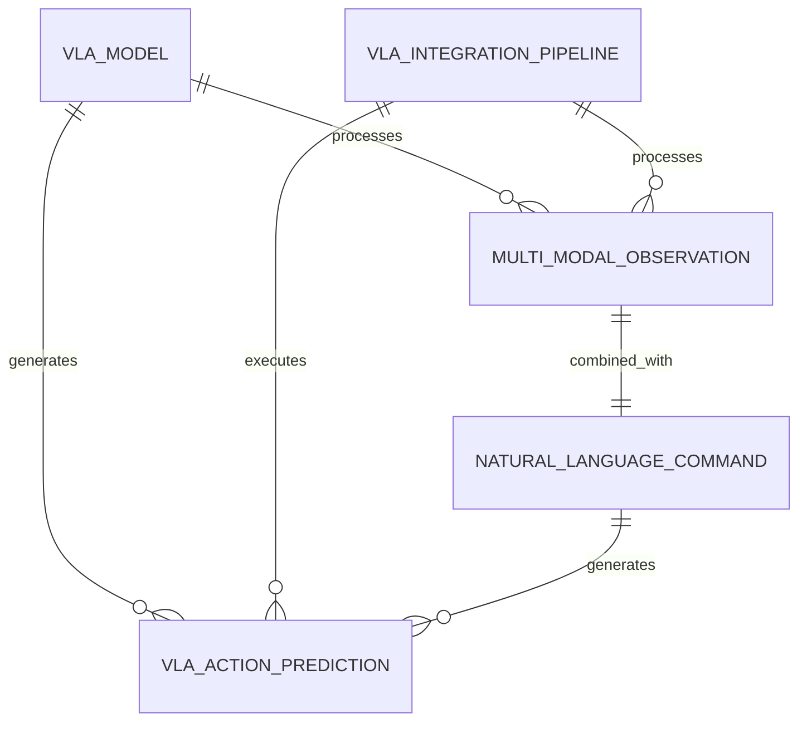

# Data Model: Phase 3 - Infrastructure Integration & Bonus Features

## Entity: User
**Description**: Represents a registered user with authentication credentials, preferences, and personalization settings

**Fields**:
- `id` (string, primary key): Unique identifier for the user
- `email` (string): User's email address
- `name` (string): User's full name
- `password_hash` (string): Hashed password (if using email/password auth)
- `auth_provider` (string): Authentication provider (email, google, github, etc.)
- `auth_provider_id` (string): Provider-specific user ID
- `created_at` (datetime): Account creation timestamp
- `updated_at` (datetime): Last update timestamp
- `user_background` (json): User's technical background, experience level, and interests
- `preferred_language` (string): User's preferred language (default: 'en')
- `theme_preference` (string): UI theme preference (light/dark)

**Relationships**:
- One-to-Many: UserProgress
- One-to-Many: Bookmark
- One-to-Many: ChatSession

**Validation Rules**:
- Email must be valid and unique
- Name must be 2-100 characters
- User background must conform to predefined schema

## Entity: UserProgress
**Description**: Tracks user's completion status for chapters, lessons, and overall course progress

**Fields**:
- `id` (string, primary key): Unique identifier for progress record
- `user_id` (string, foreign key): Reference to User
- `content_id` (string): Identifier for the content being tracked
- `content_type` (string): Type of content (chapter, lesson, section)
- `completion_percentage` (float): Completion percentage (0-100)
- `time_spent_seconds` (integer): Time spent on content in seconds
- `last_accessed_at` (datetime): Last time content was accessed
- `marked_completed_at` (datetime): When content was marked as completed
- `notes` (text): User's notes on the content

**Relationships**:
- Many-to-One: User
- Index: (user_id, content_id) for fast lookups

**Validation Rules**:
- Completion percentage must be between 0 and 100
- Time spent must be non-negative
- Content ID must reference valid content

## Entity: Bookmark
**Description**: Represents saved content references with metadata for later retrieval

**Fields**:
- `id` (string, primary key): Unique identifier for bookmark
- `user_id` (string, foreign key): Reference to User
- `content_id` (string): Identifier for the bookmarked content
- `title` (string): Title of bookmarked content
- `url_path` (string): URL path to the bookmarked content
- `created_at` (datetime): When bookmark was created
- `updated_at` (datetime): Last update timestamp
- `notes` (text): User's notes about the bookmark
- `tags` (json): Array of tags associated with the bookmark

**Relationships**:
- Many-to-One: User
- Index: (user_id, created_at) for chronological retrieval

**Validation Rules**:
- URL path must be valid
- Title must not be empty

## Entity: ChatSession
**Description**: Represents a conversation session with query history, context management, and source citations

**Fields**:
- `id` (string, primary key): Unique identifier for chat session
- `user_id` (string, foreign key): Reference to User (nullable for anonymous sessions)
- `session_token` (string): Session identifier for anonymous users
- `created_at` (datetime): Session creation timestamp
- `updated_at` (datetime): Last activity timestamp
- `title` (string): Auto-generated title based on first query
- `is_active` (boolean): Whether the session is currently active
- `language_preference` (string): Language used in this session

**Relationships**:
- Many-to-One: User (optional)
- One-to-Many: ChatMessage

**Validation Rules**:
- Either user_id or session_token must be present
- Session must expire after 24 hours of inactivity

## Entity: ChatMessage
**Description**: Represents individual messages within a chat session

**Fields**:
- `id` (string, primary key): Unique identifier for chat message
- `session_id` (string, foreign key): Reference to ChatSession
- `role` (string): Message role ('user' or 'assistant')
- `content` (text): The message content
- `created_at` (datetime): Message creation timestamp
- `sources` (json): Array of source citations for assistant responses
- `model_used` (string): LLM model used to generate response
- `tokens_used` (integer): Number of tokens in the message

**Relationships**:
- Many-to-One: ChatSession
- Index: (session_id, created_at) for chronological order

**Validation Rules**:
- Role must be 'user' or 'assistant'
- Content must not be empty

## Entity: TranslationSet
**Description**: Contains the complete set of translated content for a specific language, maintaining structural alignment with source content

**Fields**:
- `id` (string, primary key): Unique identifier for translation set
- `source_content_id` (string): Identifier for the original English content
- `target_language` (string): Target language code (e.g., 'ur' for Urdu)
- `translated_title` (string): Translated title of the content
- `translated_content` (text): Full translated content
- `translation_status` (string): Status of translation (draft, reviewed, published)
- `reviewer_notes` (text): Notes from human reviewer
- `created_at` (datetime): Translation creation timestamp
- `updated_at` (datetime): Last update timestamp
- `content_hash` (string): Hash of original content to detect changes

**Relationships**:
- Index: (source_content_id, target_language) for unique translation per language

**Validation Rules**:
- Target language must be supported
- Content hash helps track when re-translation is needed

## Entity: ContentReference
**Description**: Links translated content back to original English content for verification and cross-referencing

**Fields**:
- `id` (string, primary key): Unique identifier for content reference
- `original_content_id` (string): Identifier for the original content
- `content_type` (string): Type of content (chapter, lesson, section, page)
- `content_path` (string): File path to original content
- `content_title` (string): Title of the content in original language
- `content_hash` (string): Hash of content to detect changes
- `last_indexed_at` (datetime): When content was last processed for RAG
- `is_indexed_for_rag` (boolean): Whether content is available in vector database
- `available_languages` (json): Array of available translation languages

**Relationships**:
- One-to-Many: TranslationSet (via source_content_id)
- Index: (content_type, content_path) for fast content lookups

**Validation Rules**:
- Content path must exist in the documentation structure
- Available languages must be valid language codes

## Entity: PersonalizationProfile
**Description**: Stores user preferences and personalization settings for content recommendation

**Fields**:
- `id` (string, primary key): Unique identifier for personalization profile
- `user_id` (string, foreign key): Reference to User
- `interests` (json): Array of user interests in robotics/AI topics
- `experience_level` (string): User's experience level (beginner, intermediate, advanced)
- `learning_goals` (json): User's learning objectives
- `preferred_topics` (json): Topics user prefers to learn about
- `avoid_topics` (json): Topics user wants to avoid
- `recommended_content_queue` (json): Queue of recommended content IDs
- `created_at` (datetime): Profile creation timestamp
- `updated_at` (datetime): Last update timestamp

**Relationships**:
- Many-to-One: User

**Validation Rules**:
- Experience level must be one of the predefined values
- Interests must be from a predefined list of robotics/AI topics

## Entity: RAGDocument
**Description**: Represents a document that has been processed and indexed for the RAG system

**Fields**:
- `id` (string, primary key): Unique identifier for RAG document
- `content_reference_id` (string, foreign key): Reference to ContentReference
- `document_hash` (string): Hash of the processed document
- `chunk_count` (integer): Number of chunks this document was split into
- `embedding_model` (string): Model used for creating embeddings
- `indexed_at` (datetime): When document was indexed
- `vector_ids` (json): Array of vector IDs in the vector database
- `metadata` (json): Additional metadata for retrieval

**Relationships**:
- Many-to-One: ContentReference

**Validation Rules**:
- Document hash helps track when re-indexing is needed
- Vector IDs must exist in the vector database

# VLA Integration Data Model

## Core VLA Entities

### 1. VLAModel (Vision-Language-Action Model)
**Description**: Represents a Vision-Language-Action model instance with configuration and metadata

**Fields**:
- `id` (string, primary key): Unique identifier for the VLA model
- `name` (string): Descriptive name of the model
- `description` (text): Detailed description of model capabilities
- `model_type` (string): Type of VLA model (openvla, rt2, palm-e, etc.)
- `architecture` (string): Neural network architecture (transformer, cnn-lstm, etc.)
- `checkpoint_path` (string): Path to model weights file
- `model_config` (json): Configuration parameters dictionary
- `input_resolution` (json): Input image resolution [width, height]
- `action_space_dim` (integer): Dimension of action space output
- `device` (string): Computation device (cuda, cpu)
- `gpu_accelerated` (boolean): Whether model uses GPU acceleration
- `created_at` (datetime): Model creation timestamp
- `updated_at` (datetime): Last update timestamp

**Validation Rules**:
- Model type must be one of supported VLA model types
- Input resolution must be positive integers
- Action space dimension must be positive
- Checkpoint path must be accessible

### 2. MultiModalObservation
**Description**: Captures multi-modal sensor data for VLA processing

**Fields**:
- `id` (string, primary key): Unique observation identifier
- `image_data_path` (string): Path to RGB image data
- `depth_data_path` (string): Path to depth image data
- `sensor_data` (json): Additional sensor readings (IMU, LIDAR, etc.)
- `environment_context` (json): Contextual environmental information
- `timestamp` (float): Observation timestamp
- `frame_id` (string): Coordinate frame identifier
- `source_device` (string): Device that captured the observation
- `confidence_score` (float): Confidence in observation quality (0-1)
- `preprocessing_metadata` (json): Information about preprocessing applied

**Relationships**:
- One-to-Many: VLAActionPrediction (via observation_id)

**Validation Rules**:
- Timestamp must be recent (within 1 second)
- Confidence score must be between 0 and 1
- Image and depth paths must be valid

### 3. NaturalLanguageCommand
**Description**: Represents natural language commands processed by VLA models

**Fields**:
- `id` (string, primary key): Unique command identifier
- `text` (text): Original natural language text
- `intent` (string): Parsed intent from the command
- `entities` (json): Named entities extracted from command
- `language` (string): Language of the command
- `confidence` (float): Confidence in parsing accuracy (0-1)
- `parsed_structure` (json): Structured representation of command
- `created_at` (datetime): Command creation timestamp
- `source` (string): Source of the command (voice, text, etc.)
- `intent_confidence` (float): Confidence in intent classification (0-1)
- `action_sequence` (json): Array of actions derived from command

**Validation Rules**:
- Text must not be empty
- Confidence must be between 0 and 1
- Intent must be recognized type
- Language must be supported

### 4. VLAActionPrediction
**Description**: Represents action predictions generated by VLA models

**Fields**:
- `id` (string, primary key): Unique action prediction identifier
- `observation_id` (string, foreign key): Reference to MultiModalObservation
- `model_id` (string, foreign key): Reference to VLAModel
- `action_type` (string): Type of action (navigation, manipulation, etc.)
- `action_vector` (json): Numerical representation of action
- `parameters` (json): Additional action parameters
- `confidence` (float): Confidence in action prediction (0-1)
- `status` (string): Execution status (pending, executing, completed, failed)
- `timestamp` (datetime): Prediction creation timestamp
- `executor_id` (string): ID of action executor
- `execution_time` (interval): Time taken to execute action
- `safety_validation` (json): Safety validation results

**Relationships**:
- Many-to-One: MultiModalObservation
- Many-to-One: VLAModel

**Validation Rules**:
- Action vector must match expected dimensions
- Confidence must be between 0 and 1
- Action type must be valid for robot

### 5. VLAIntegrationPipeline
**Description**: Represents an integration pipeline for VLA processing

**Fields**:
- `id` (string, primary key): Unique pipeline identifier
- `name` (string): Pipeline name
- `description` (text): Pipeline description
- `pipeline_config` (json): Configuration parameters
- `components` (json): Array of pipeline components
- `processing_frequency` (decimal): Processing frequency in Hz
- `enabled` (boolean): Whether pipeline is active
- `created_at` (datetime): Pipeline creation timestamp
- `updated_at` (datetime): Last update timestamp
- `performance_metrics` (json): Performance tracking data

**Validation Rules**:
- Processing frequency must be positive
- Components must be valid pipeline elements
- Config must be valid JSON

## VLA Integration Relationships

### Multi-Modal Data Flow


### Performance Tracking
- `VLAActionPrediction` → `VLAIntegrationPipeline`: Performance metrics aggregation
- `MultiModalObservation` → `VLAActionPrediction`: Input-output relationship
- `NaturalLanguageCommand` → `VLAActionPrediction`: Command-action relationship

## VLA Message Types

### ROS 2 Message Definitions for VLA Integration

#### VLAAction.msg
```
# VLA action message for Physical AI systems
string id
string action_type
float64[] action_vector
float64 confidence
string status
builtin_interfaces/Time timestamp
string executor_id
float64 execution_time
bool safety_approved
string[] safety_violations
```

#### MultiModalObservation.msg
```
# Multi-modal observation for VLA systems
string id
sensor_msgs/Image rgb_image
sensor_msgs/Image depth_image
sensor_msgs/LaserScan laser_scan
geometry_msgs/PoseStamped robot_pose
std_msgs/String environment_context
float64 timestamp
float64 confidence_score
string source_device
```

#### NaturalLanguageCommand.msg
```
# Natural language command for VLA systems
string id
string text
string intent
float64 confidence
string language
builtin_interfaces/Time timestamp
string source
float64 intent_confidence
string[] action_sequence
```

## Validation and Safety Constraints

### Data Validation Rules
1. **VLA Model Validation**:
   - Model checkpoint path must exist and be accessible
   - Input resolution must be positive integers
   - Action space dimension must be positive
   - Confidence scores must be between 0 and 1

2. **Observation Validation**:
   - Timestamp must be recent (within 1 second)
   - Confidence score must be between 0 and 1
   - Image data path must be valid
   - Sensor data format must match expected schema

3. **Command Validation**:
   - Text must not be empty
   - Confidence must be between 0 and 1
   - Intent must be recognized type
   - Language must be supported

4. **Action Validation**:
   - Action vector must match expected dimensions
   - Confidence must be between 0 and 1
   - Action type must be valid for robot
   - Safety validation must pass

### Business Rules
1. **Safety Validation Rule**: All robot actions must pass safety validation before execution
2. **Confidence Threshold Rule**: Actions with confidence below threshold are rejected
3. **Resource Limit Rule**: Pipeline processing respects computational resource limits
4. **Real-time Constraint Rule**: Processing must complete within specified time limits

## Performance Requirements

### Processing Requirements
- **Latency**: VLA inference must complete within 100ms
- **Throughput**: System must handle 10+ inferences per second
- **Accuracy**: Action prediction accuracy must exceed 85%
- **Reliability**: System must maintain 99%+ uptime

### Resource Requirements
- **GPU Memory**: VLA models must fit within allocated GPU memory
- **CPU Usage**: Pipeline processing should not exceed 80% CPU
- **Memory Usage**: System should not exceed 85% memory usage
- **Network**: Low-latency communication for real-time operation

This comprehensive data model provides the foundation for implementing VLA integration in Physical AI systems, ensuring proper data flow, validation, and performance characteristics for production deployment.